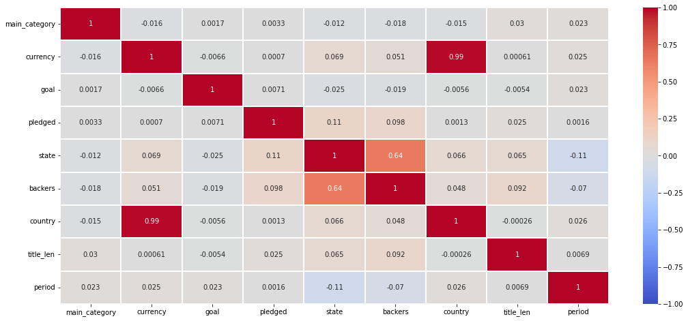
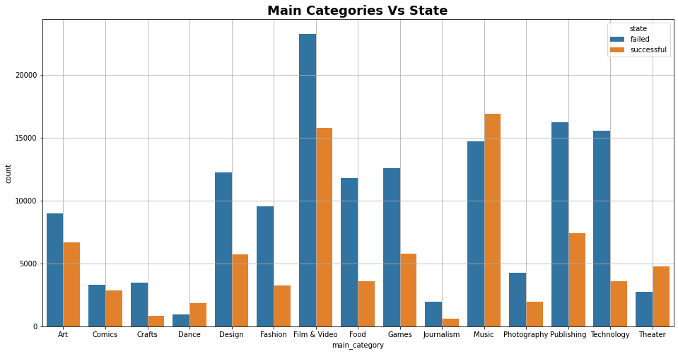
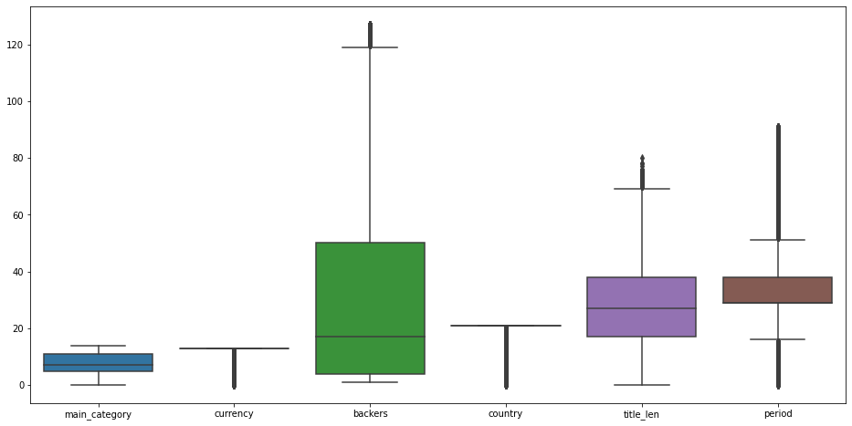

# Early Stage Project Success Measurement
---

The main goal of the project is to determine if a startup idea will succeed or fail that is a useful tool for entrepreneurs to assess their ideas and for investors to determine to invest or not.

---

## Data Discovery

* The number of unique value per feature indicates that some features have high-cardinality which will cause modeling issues that will decrease the performance of any model by overfitting it.

* The Min. & Max. values of each feature require some filtering or scaling/transformation.

* Some features must be dropped since they will interfere with the target feature.

* Extra features could be extracted from the current data to increase the performance of prediction.

---

## Data Visualization

### 1. Correlation Between Features

**Notes:**
* The maximum correlation with the target column "state" is the number of backers with 64%. Also, the "state" has a positive correlation with the pledge amount of money with 11%. In contrast, the "state" has a negative correlation with the launched project year and how long was it on "period" both with -11%.

* The currency is correlated with the country as expected so one of them must be dropped before training.

* The launched project year is negatively correlated with the country -29%.
---

### 2. Success and Failure Counts Per Main Category

Film & Video has the most failed projects while the Music category has the most successful one relative to the category.

---
### 3. Success and Failure Counts Per Main Category

Obviously, most features have outliers and needed to be considered especially when using deep neural networks.